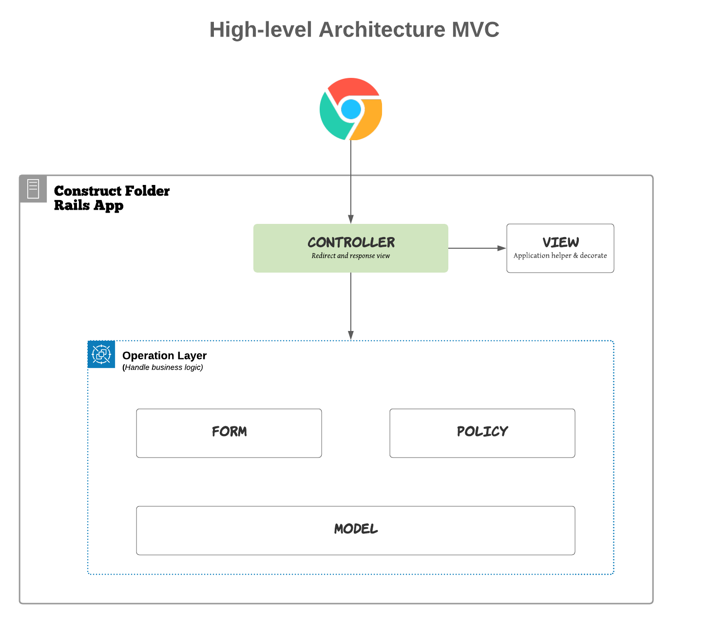

# Giới thiệu Mô hình High-level Architecture MVC

## Giới thiệu

Bao gồm:
- Controller
- Form
- Operation
- Model
- View
- Decorator
- ApplicationHelper

## Thành phần
### 1. Controller:
- Controler chỉ đảm nhiệm vai trò điều hướng, nhận output từ operation, đồng thời xử lý flash message nếu có

### 2. Operation
- Xử lí logic STEP BY STEP (mỗi step là đơn nhiệm, mỗi function là đơn nhiệm), nếu error xảy ra ở step nào thì dừng ngay tại step đó.
- Các method được gọi trong hàm call sẽ bắt đầu từ prefix `step_`.
- Sau khi validate thì không được thay đổi, format params. Hãy lấy các giá trị từ Form để thao tác vào DB.

### 3. Form
- Xử lý validate dữ liệu (không xử lý params). Được gọi ở trong Operation class

### 4. Model
- Chỉ thể hiện quan hệ, và scope, không xử lí logic.
- Nếu có logic cần xử lí: Tạo module Concern (ứng với model). Với suffix _finder.rb -> include vào model
- Những validate trước đây giữ nguyên, nếu có nhu cầu refactor thì báo lên cho PM nắm

### 5. View
- Nên tạo folder chia theo dạng component, tách partial theo từng component. Không viết view kiểu dàn trãi.
- Decorator: Dùng để xử lý logic cho View

### 6. ApplicationHelper
- Dùng để viết các method mà sử dụng lại nhiều lần. Phạm vi áp dụng cho toàn project

Ngoài ra cần chú ý đến

### 7. Decorator
-  Dùng để xử lý logic của view, không được sử dụng bất cứ ở đâu ngoài trừ view

### CSS
- Viết dạng Sass
- Các Class, Component thì sẽ viết common. Còn màn hình nào riêng biệt thì viết trong folder pages.

### JAVASCRIPT
- Viết dạng coffee.
- Trang client: Viết dạng AngularJS
- Trang admin: Viết dạng JS thuần
- Chia các component nếu như cần thiết.

